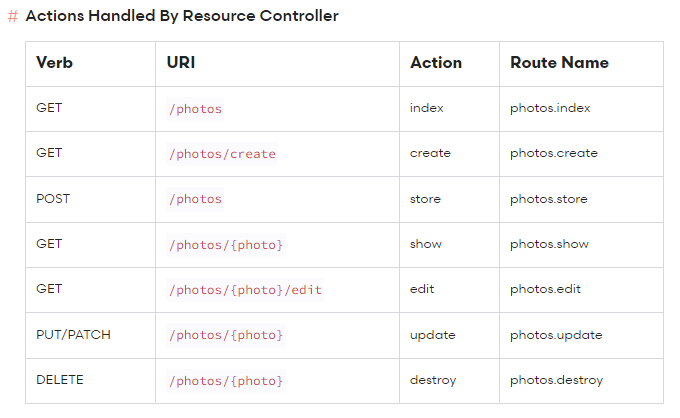

## About Laravel

Laravel is a web application framework with expressive, elegant syntax. We believe development must be an enjoyable and creative experience to be truly fulfilling. Laravel takes the pain out of development by easing common tasks used in many web projects, such as:

-   [Simple, fast routing engine](https://laravel.com/docs/routing).
-   [Powerful dependency injection container](https://laravel.com/docs/container).
-   Multiple back-ends for [session](https://laravel.com/docs/session) and [cache](https://laravel.com/docs/cache) storage.
-   Expressive, intuitive [database ORM](https://laravel.com/docs/eloquent).
-   Database agnostic [schema migrations](https://laravel.com/docs/migrations).
-   [Robust background job processing](https://laravel.com/docs/queues).
-   [Real-time event broadcasting](https://laravel.com/docs/broadcasting).

Laravel is accessible, powerful, and provides tools required for large, robust applications.

## Learning Laravel

Laravel has the most extensive and thorough [documentation](https://laravel.com/docs) and video tutorial library of all modern web application frameworks, making it a breeze to get started with the framework.

You may also try the [Laravel Bootcamp](https://bootcamp.laravel.com), where you will be guided through building a modern Laravel application from scratch.

If you don't feel like reading, [Laracasts](https://laracasts.com) can help. Laracasts contains over 2000 video tutorials on a range of topics including Laravel, modern PHP, unit testing, and JavaScript. Boost your skills by digging into our comprehensive video library.

## Laravel Sponsors

We would like to extend our thanks to the following sponsors for funding Laravel development. If you are interested in becoming a sponsor, please visit the Laravel [Patreon page](https://patreon.com/taylorotwell).

### Premium Partners

-   **[Vehikl](https://vehikl.com/)**
-   **[Tighten Co.](https://tighten.co)**
-   **[Kirschbaum Development Group](https://kirschbaumdevelopment.com)**
-   **[64 Robots](https://64robots.com)**
-   **[Cubet Techno Labs](https://cubettech.com)**
-   **[Cyber-Duck](https://cyber-duck.co.uk)**
-   **[Many](https://www.many.co.uk)**
-   **[Webdock, Fast VPS Hosting](https://www.webdock.io/en)**
-   **[DevSquad](https://devsquad.com)**
-   **[Curotec](https://www.curotec.com/services/technologies/laravel/)**
-   **[OP.GG](https://op.gg)**
-   **[WebReinvent](https://webreinvent.com/?utm_source=laravel&utm_medium=github&utm_campaign=patreon-sponsors)**
-   **[Lendio](https://lendio.com)**

## Contributing

Thank you for considering contributing to the Laravel framework! The contribution guide can be found in the [Laravel documentation](https://laravel.com/docs/contributions).

## Code of Conduct

In order to ensure that the Laravel community is welcoming to all, please review and abide by the [Code of Conduct](https://laravel.com/docs/contributions#code-of-conduct).

## Security Vulnerabilities

If you discover a security vulnerability within Laravel, please send an e-mail to Taylor Otwell via [taylor@laravel.com](mailto:taylor@laravel.com). All security vulnerabilities will be promptly addressed.

## License

The Laravel framework is open-sourced software licensed under the [MIT license](https://opensource.org/licenses/MIT).

## Important commands

### PHP Commands
Command to migrate and connect a database

`
php artisan migrate
`

Command to migrate delete the migrate to the database

`
php artisan migrate:rollback
`

Run local serve

`
php artisan serve
`

### NPM Commands

Install tailwind in vite

`
npm install -D tailwindcss postcss autoprefixer
`

Create tailwind.config and postcss.config 

`
npx tailwindcss init -p
`
### Artisan

CLI provide for laravel

`
php artisan
`

Get info about how to create a controller

`
php artisan make:controller --help
`

Creating controller

`
php artisan make:controller nameController
`

Creating controller in a specific folder

`
php artisan make:controller Folder\\NameController
`

Convention to name controllers methods 

Models

`
php artisan make:model nameModelSingular
`

Creating model, migration, controller or factory using flags

`
php artisan make:model --migration --controller --factory name
`

### Migrations
Version control of our databases

Create a migration

`
php artisan migrate
`

do a rollback in a migration

`
php artisan migrate:rollback
`

other ways to do a migration

`
php artisan make:migration name_migration
`

Create a new migration an delete the registers in the db

`
php artisan migrate:refresh
`

the use of descriptive names in laraval going to help you to manage db more easily

`
php artisan make:migration create_posts_table
`

### Tinker CLI

This is a cli where we can interact with data and db of our app

the use of descriptive names in laraval going to help you to manage db more easily

`
php artisan tinker
`

Search a register in out data base

`
$usuario = User::find(id);
`

We can run a factory using the namespace

`
App\Models\Post::factory();
`

also we can use a alias like this

`
Post::factory();
`

Execute a factory the times that you need

`
App\Models\Post::factory()->times(200)->create();
`

If we see issues executing the mistakes we can do a rollback to delete the try info and execute a migrate again to try again or use your migration after each modify in your code you need up tinker again if you want do tries

Consult relations using tinker

1. find the model
2. Check the model ralationated 

`
$model = Model::find(id)
$model->modelRelation
`
### Policies

The policies help to do some actions to a model associate 

Command 

the flag --model associate a policy with the model given 

`
php artisan make:policy PostPolicy --model=post
`
### Routes

Commands that going to help you to manage route

command to clear the cache, you can use this after that you change the path of your routes and don charge

`
php artisan route:cache
`

Command to consult how the route are use and what controller is manage it

`
php artisan route:list
`